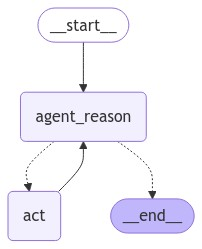
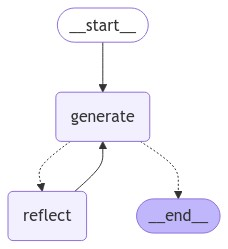
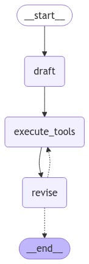

<h1 align="center">Agent Compilation</h1>

<p align="center">
  
  
  
  
</p>

<p align="center">
  <a href="#dart-about">About</a> &#xa0; | &#xa0; 
  <a href="#sparkles-features">Features</a> &#xa0; | &#xa0;
  <a href="#rocket-technologies">Technologies</a> &#xa0; | &#xa0;
  <a href="#white_check_mark-requirements">Requirements</a> &#xa0; | &#xa0;
  <a href="#checkered_flag-starting">Starting</a> &#xa0; | &#xa0;
  <a href="#memo-license">License</a> &#xa0; | &#xa0;
  <a href="https://github.com/mariotoribi0" target="_blank">Author</a>
</p>

<br>

## :dart: About ##

**Agent Compilation** is a suite of intelligent agents developed to perform various specialized tasks, each supported by tools such as LangGraph and LangChain. Key agents include:

- **React Agent**: Interacts with users and generates contextual responses, adapting to different prompts and queries.  
  

- **Tweet Reflection Agent**: Analyzes and reflects on Twitter content, summarizing, analyzing sentiment, or providing insights based on user-selected tweets.  
  

- **Writer Agent**: Assists in content generation and editing, using structured prompts to create articles, stories, or documentation.  
  

## :sparkles: Features ##

:heavy_check_mark: Modular, scalable agent system;\
:heavy_check_mark: Integrates LangGraph and LangChain for powerful language processing;\
:heavy_check_mark: Supports real-time interaction with agents.

## :rocket: Technologies ##

This project uses the following tools and libraries:

- [LangGraph](https://langgraph.io/) - Graph-based NLP framework
- [LangChain](https://langchain.com/) - Language model chaining and management
- [Python](https://www.python.org/) - Core programming language
- [Poetry](https://python-poetry.org/) - Dependency management and packaging

## :white_check_mark: Requirements ##

Before starting, ensure you have [Git](https://git-scm.com), [Python](https://www.python.org/), and [Poetry](https://python-poetry.org/) installed.

## :checkered_flag: Starting ##

```bash
# Clone this project
$ git clone https://github.com/mariotoribi0/agents-compilation

# Access the project folder
$ cd agents-compilation

# Install dependencies with Poetry
$ poetry install

# Activate the virtual environment
$ poetry shell

# Run the project
$ python agents/<MODEL>/main.py
```

## :memo: License ##

This project is under license from MIT. For more details, see the [LICENSE](LICENSE.md) file.


Made with :heart: by <a href="https://github.com/mariotoribi0" target="_blank">Mario Toribio</a>

&#xa0;

<a href="#top">Back to top</a>
